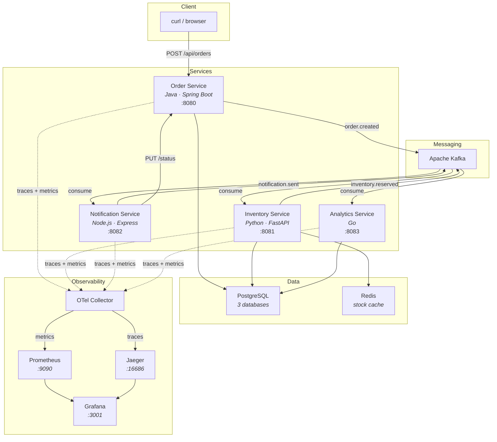
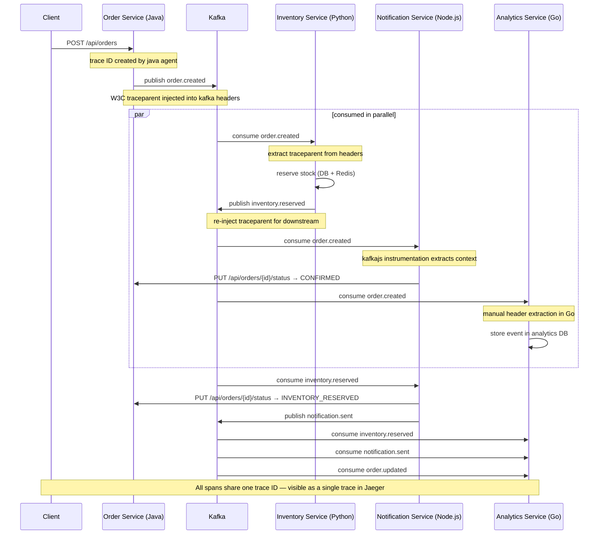

# ShopFlow — OpenTelemetry Agent Polyglot PoC

## Why OpenTelemetry Agents in Microservices?

In a monolith, debugging is straightforward — one process, one log stream, one stack trace.
Microservices break that. A single user request can hop through 5+ services, each with its own language,
framework, and logging format. When something fails, you're left grepping through scattered logs
trying to piece together what happened.

**OpenTelemetry (OTel) solves this by giving every request a unique trace ID** that follows it
across service boundaries — HTTP calls, Kafka messages, gRPC, whatever. Each service adds "spans"
(timed operations) to the trace, so you can see the full picture in one place.

OTel agents can hook into your framework at startup and automatically capture **some** operations
without code changes. But this is not magic — **auto-instrumentation only covers a subset of
libraries**, mostly HTTP inbound/outbound, popular SQL drivers, and a few messaging clients.
Anything outside that list requires manual instrumentation in your code.

This PoC demonstrates that across 4 different languages — with varying levels of "zero" depending
on language maturity.

### OTel Agent Approach by Language

| Language | Instrumentation | How it works | Code changes needed |
|---|---|---|---|
| **Java** | `-javaagent:opentelemetry-javaagent.jar` | JVM bytecode manipulation at startup | **Zero** — just a JVM flag |
| **Python** | `opentelemetry-instrument` CLI | Wraps your process and monkey-patches libraries at import time | **Zero** for supported libs, manual for others |
| **Node.js** | `--require ./tracing.js` | Loads a setup script before your app that registers instrumentations | **Minimal** — ~30 lines of setup |
| **Go** | OTel SDK in code | No runtime agent exists — you wire up the SDK manually | **SDK-level** — everything is explicit |

> Go doesn't have a runtime agent because the language compiles to a static binary — there's no
> classloader or module system to hook into. You set up the SDK once in `main()` and use thin
> wrappers (like `otelhttp`) around your handlers.

---

## What Gets Auto-Instrumented (and What Doesn't)

**Auto-instrumentation is NOT universal.** It only covers libraries that have a matching
instrumentation plugin. The rule of thumb:

| Category | Auto-instrumented? | Notes |
|---|---|---|
| HTTP servers/clients | Yes (all 4 languages) | Best coverage across the board |
| SQL via standard drivers | Yes (JDBC, asyncpg, pg, otelsql) | Java has the widest driver support |
| Redis | Yes (Java, Python, Node) | Go needs manual wrapper |
| Kafka | Partial | Java: auto. Python: `confluent-kafka` yes, **`aiokafka` no**. Node: needs explicit `instrumentation-kafkajs` pkg. Go: manual |
| Neo4j, ClickHouse, graph DBs | Mostly no | Neo4j has no auto-instrumentation in any language. ClickHouse only auto in Java |
| Business logic | Never | "validate order", "calculate tax" — always manual spans |

**Key gaps we hit in this PoC:**
- Python `aiokafka` — no auto-instrumentation exists, so we wrote manual trace context extraction/injection
- Node.js `kafkajs` — requires adding `@opentelemetry/instrumentation-kafkajs` as a separate package
- Go — no runtime agent at all; everything is explicit SDK wiring

> For a detailed per-language breakdown (200+ libraries, version ceilings, known gotchas),
> see our [companion blog post](blog-1-otel-polyglot-tracing.md).

---

## Performance Overhead

**OTel agents are not free.** They run inside your application process — sharing CPU, memory,
and adding latency to every instrumented operation.

| Impact | Java | Python | Node.js | Go |
|---|---|---|---|---|
| **Startup** | +20–100% slower | +1–3s | +0.5–5s | None (compiled in) |
| **CPU** | +2–5% runtime | +2–5% | +2–5% | +1–3% |
| **Memory** | +50–200 MB | +20–80 MB | +20–80 MB | Minimal |

At **100% sampling under heavy load**, overhead can spike significantly (up to 20% CPU,
33% throughput drop in Java). Production deployments should use **probabilistic** or
**tail-based sampling** to control volume.

> This PoC uses 100% sampling for visibility. For deep dives on startup penalties,
> GraalVM incompatibility, memory leaks, and cardinality limits, see our
> [companion blog post](blog-1-otel-polyglot-tracing.md).

---

## Limitations and Caveats

Things the "zero-code OTel" marketing doesn't tell you:

### 1. Auto-instrumentation only covers popular libraries

If your service talks to Neo4j, ClickHouse (in Python/Node), ArangoDB, InfluxDB,
TimescaleDB (direct protocol), or any custom RPC — **you get no spans for those calls**.
You'll need to manually create spans:

```python
# python — manual span for a Neo4j call
from opentelemetry import trace
tracer = trace.get_tracer("my-service")

with tracer.start_as_current_span("neo4j.query", attributes={
    "db.system": "neo4j",
    "db.statement": "MATCH (n:User) RETURN n",
}):
    result = neo4j_driver.session().run("MATCH (n:User) RETURN n")
```

```java
// java — manual span for unsupported library
Span span = tracer.spanBuilder("custom.operation")
    .setAttribute("db.system", "neo4j")
    .startSpan();
try (Scope scope = span.makeCurrent()) {
    // your call here
} finally {
    span.end();
}
```

```javascript
// node.js — manual span
const span = tracer.startSpan('neo4j.query', {
  attributes: { 'db.system': 'neo4j' },
});
try {
  // your call here
} finally {
  span.end();
}
```

### 2. Message broker support is inconsistent

| Broker + Client | Java | Python | Node.js | Go |
|---|---|---|---|---|
| Kafka (native clients) | Auto | confluent-kafka: Auto, **aiokafka: Manual** | **kafkajs: Needs explicit package** | Manual |
| RabbitMQ | Auto | pika: Auto | amqplib: Auto | Manual |
| Pulsar | Auto | Manual | Manual | Manual |
| NATS | Auto | Manual | Manual | Manual |
| Custom brokers | Manual | Manual | Manual | Manual |

### 3. Trace context doesn't propagate through message brokers automatically

Even when consume/produce is instrumented, **W3C trace context propagation through message
headers** is a separate concern. Without it, each consumer starts an isolated trace.
This PoC specifically fixes this for:
- Java (Spring Kafka): auto-propagated by the java agent
- Python (aiokafka): manual `extract_trace_ctx()` / `build_trace_headers()`
- Node.js (kafkajs): handled by `@opentelemetry/instrumentation-kafkajs`
- Go (sarama): manual header extraction in `consumer.go`

### 4. Version lag and compatibility gaps are real

When a library releases a new major version, the OTel instrumentation may not support it
immediately. Real-world examples:
- **Java**: Apache Camel 2.20+ is supported but "3.0+ not yet". Many OTel Java artifacts still carry `-alpha` suffix
- **Python**: `confluent-kafka` instrumentation only covers 1.8.2–2.11.0. Versions outside this range are silently ignored
- **Python**: `SQLAlchemy` instrumentation caps at 2.1.0 — newer releases may not be covered
- **Node.js**: `require-in-the-middle` (which powers auto-instrumentation) was designed for CommonJS. ESM (import/export) support is still limited
- **Go**: `otelsarama` references the old `Shopify/sarama` import path. The library moved to `IBM/sarama` and the contrib package hasn't fully caught up
- **Java**: GraalVM Native Image is completely incompatible with the javaagent

### 5. Memory leaks have been reported

In long-running processes, some OTel implementations have had memory leak issues:
- **Java**: ThreadLocal objects from the exporter not cleaned up on application stop
- **Python**: Strong references in MeterProvider problematic in serverless/short-lived processes
- **.NET**: Meter instance lifecycle issues
- **OTel Collector**: Memory growth when processing traces with thousands of spans

### 6. The agent runs in-process

Unlike external observability tools (like eBPF-based solutions), OTel agents share your
application's process, memory, and CPU. This means:
- A bug in the agent can crash your app
- Memory pressure from span buffering affects your app's heap
- If the collector is down, the exporter retries can consume resources
- You can't upgrade the agent without redeploying your app

### 7. High cardinality kills performance

Adding attributes like `user.id`, `request.url` (with query params), or `db.statement`
(with literal values) to every span creates high-cardinality time series in Prometheus.
OTel's default cardinality limit is **2,000 series per metric** — exceeding this causes
**silent metric drops** (reported via the internal `otel_metrics_overflow` metric).
This can blow up memory in both the collector and Prometheus.

### 8. Business logic is never auto-instrumented

Auto-instrumentation only captures infrastructure calls (HTTP, DB, messaging). If you want
spans for business operations like "validate order", "calculate tax", or "check fraud score",
you need to add manual spans in your code. The agent can't read your mind.

---

## What This PoC Does

ShopFlow is a fake e-commerce backend with 4 services that communicate through Kafka events.
The goal is to show a **single distributed trace flowing through all 4 services** when you create an order.

### Architecture Diagram



### Trace Propagation Flow



---

## Getting Started

### Prerequisites

- Docker and Docker Compose (v2+)
- ~4 GB of free RAM (13 containers)
- Ports available: 3001, 4317, 4318, 5432, 6379, 8080–8083, 8090, 9090, 16686

### Start Everything

```bash
chmod +x start.sh stop.sh
./start.sh
```

This builds all 4 services, starts infra (Postgres, Redis, Kafka, OTel Collector, Jaeger,
Prometheus, Grafana), waits for health checks, and prints all URLs when ready.

### Stop Everything

```bash
./stop.sh
# or
docker compose down -v   # -v removes volumes too
```

---

## Test It

### Create an Order

```bash
curl -X POST http://localhost:8080/api/orders \
  -H "Content-Type: application/json" \
  -d '{
    "customerId": "CUST-001",
    "productId": "PROD-001",
    "quantity": 2,
    "unitPrice": 1299.99
  }'
```

This single request kicks off the full event chain across all 4 services.

### Fire a Batch (for more interesting traces)

```bash
for i in {1..10}; do
  curl -s -X POST http://localhost:8080/api/orders \
    -H "Content-Type: application/json" \
    -d "{\"customerId\":\"CUST-00$i\",\"productId\":\"PROD-00$((i % 5 + 1))\",\"quantity\":$i,\"unitPrice\":49.99}" &
done
wait
```

### Check Service Status

```bash
# health checks
curl http://localhost:8080/api/orders/health     # order-service
curl http://localhost:8081/health                 # inventory-service
curl http://localhost:8082/health                 # notification-service
curl http://localhost:8083/health                 # analytics-service
curl http://localhost:13133                       # otel collector

# list orders
curl http://localhost:8080/api/orders | python3 -m json.tool

# check stock levels
curl http://localhost:8081/api/products | python3 -m json.tool

# analytics reports (generated every 60s)
curl http://localhost:8083/api/reports | python3 -m json.tool
```

---

## Viewing Traces, Spans, and Metrics

### Jaeger — Distributed Traces

Open **http://localhost:16686**

1. **Service dropdown** → select `order-service`
2. Click **Find Traces**
3. Click any trace to expand the span timeline

What you should see in a single trace:

| Span | Service | What it represents |
|---|---|---|
| `POST /api/orders` | order-service | Incoming HTTP request |
| `kafka.produce order.created` | order-service | Kafka publish (auto-instrumented by java agent) |
| `kafka.consume order.created` | inventory-service | Kafka consume (manual context extraction) |
| `SELECT ... FOR UPDATE` | inventory-service | Row lock for stock reservation |
| `kafka.produce inventory.reserved` | inventory-service | Publish reservation event |
| `kafka.consume order.created` | notification-service | Kafka consume (kafkajs instrumentation) |
| `PUT /api/orders/{id}/status` | notification-service → order-service | REST callback to update status |
| `kafka.consume order.created` | analytics-service | Kafka consume (manual Go extraction) |
| `INSERT INTO order_events` | analytics-service | Store event for reporting |

All of these spans share the **same trace ID** — that's the point. One request, one trace,
four services, full visibility.

### Verify Trace Propagation via CLI

```bash
# grab the latest trace from jaeger's API
curl -s "http://localhost:16686/api/traces?service=order-service&limit=1" | \
  python3 -c "
import json, sys
data = json.load(sys.stdin)
trace = data['data'][0]
services = set()
for span in trace['spans']:
    pid = span['processID']
    svc = trace['processes'][pid]['serviceName']
    services.add(svc)
print(f'Trace ID: {trace[\"traceID\"]}')
print(f'Spans: {len(trace[\"spans\"])}')
print(f'Services: {sorted(services)}')
"
```

Expected output:
```
Trace ID: abc123...
Spans: 40+
Services: ['analytics-service', 'inventory-service', 'notification-service', 'order-service']
```

If you see all 4 services, trace propagation through Kafka is working correctly.

### Prometheus — Metrics

Open **http://localhost:9090** and try these queries:

```promql
# total orders created
shopflow_shopflow_orders_created_total

# HTTP request rate across services
rate(http_server_request_duration_seconds_count[5m])

# inventory reservation counter
shopflow_inventory_reservations_total

# notification processing latency (p95)
histogram_quantile(0.95, rate(shopflow_notification_processing_duration_seconds_bucket[5m]))
```

### Direct Metrics Endpoints

Each service also exposes a `/metrics` (or `/actuator/prometheus`) endpoint:

```bash
curl http://localhost:8080/actuator/prometheus   # java (spring actuator)
curl http://localhost:8081/metrics               # python (prometheus_client)
curl http://localhost:8082/metrics               # node (prom-client)
curl http://localhost:8083/metrics               # go (promhttp)
```

### Grafana — Dashboards

Open **http://localhost:3001** (login: `admin` / `admin`)

- Prometheus and Jaeger datasources are pre-provisioned
- Go to **Explore** → select **Jaeger** → search traces by service name
- Go to **Explore** → select **Prometheus** → run PromQL queries

### Kafka UI

Open **http://localhost:8090** to see:

- Topics: `order.created`, `inventory.reserved`, `inventory.failed`, `notification.sent`, `order.updated`
- Consumer group lag
- Message payloads and headers (including `traceparent` headers used for trace propagation)

---

## Troubleshooting

```bash
# container status
docker compose ps

# tail logs for a specific service
docker compose logs -f order-service
docker compose logs -f inventory-service
docker compose logs -f notification-service
docker compose logs -f analytics-service

# check collector and kafka logs
docker compose logs -f otel-collector
docker compose logs -f kafka

# full rebuild from scratch
docker compose down -v && docker compose up --build -d
```

---

## Key Takeaway

OTel agents give you a strong baseline of observability with minimal code — **for the libraries
they support**. HTTP inbound/outbound, popular SQL drivers, and Redis are well covered across
all languages. But the moment you step outside that (Neo4j, ClickHouse in Python/Node, async
Kafka clients, custom protocols), you're writing manual spans.

The Java agent has the best coverage by far. Python and Node.js are decent but have notable gaps.
Go has no agent at all — everything is explicit.

For Kafka-based architectures, the hardest part isn't instrumenting produce/consume — it's
**propagating trace context through message headers** so consumers join the same trace as
the producer. This PoC demonstrates that working across all 4 languages, with the manual
workarounds needed where auto-instrumentation falls short.

**Bottom line**: OTel agents are a great starting point, not a complete solution. Plan for
manual instrumentation wherever your stack uses libraries that aren't on the supported list.

See **[TESTING.md](TESTING.md)** for the full list of curl commands, PromQL queries, and troubleshooting steps.
