# Zero-Code Distributed Tracing Across Four Languages — A Hands-On OpenTelemetry Proof of Concept

*A practical exploration of wiring Java, Python, Node.js, and Go microservices into a single distributed trace — flowing through Kafka, PostgreSQL, and Redis — with minimal instrumentation code.*

---

## The Observability Gap in Polyglot Architectures

Microservices deliver on their promise of independent deployability and team autonomy. What they quietly introduce, however, is a debugging problem that grows with every service added to the graph.

Consider a customer reporting a failed order. In a monolith, one stack trace tells the story. In a distributed system, the evidence is scattered across four log streams, four formats, and four runtimes:

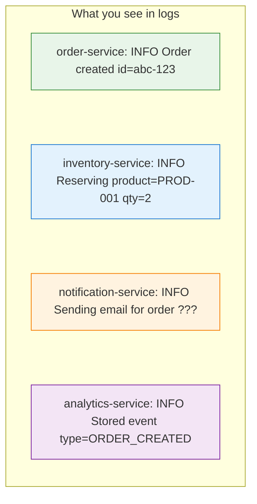

Which order does the notification belong to? Did inventory even process it? Correlating timestamps across services is fragile at best and impossible at worst.

**OpenTelemetry (OTel) addresses this by assigning a unique trace ID to every request** and propagating it across service boundaries — whether the communication happens over HTTP, Kafka, gRPC, or any other protocol. Each operation within the request becomes a **span** with precise timing, attributes, and parent-child relationships.

The critical question for engineering teams adopting OTel: **how much code do you actually need to write?**

We built a proof of concept to answer that definitively. Four services, four languages, one trace. This article documents what we built, what worked automatically, and where we had to intervene.

---

## What We Built

**ShopFlow** is a simulated e-commerce backend with four microservices communicating through Apache Kafka events:

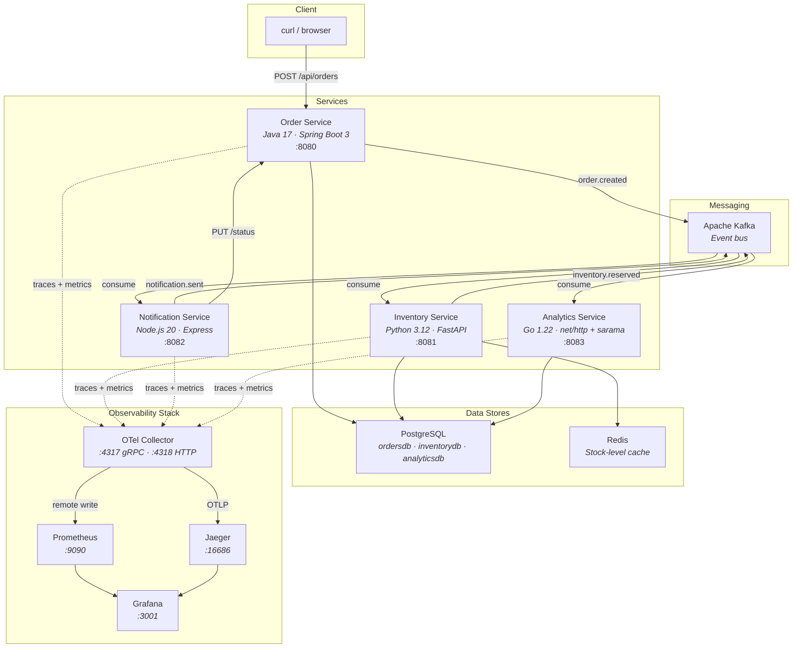

The supporting infrastructure — PostgreSQL (three databases), Redis, Kafka, OTel Collector, Jaeger, Prometheus, and Grafana — runs alongside the services via Docker Compose. Thirteen containers total.

---

## The Event Chain — What a Single Order Triggers

A single `POST /api/orders` initiates an asynchronous event chain that touches all four services:

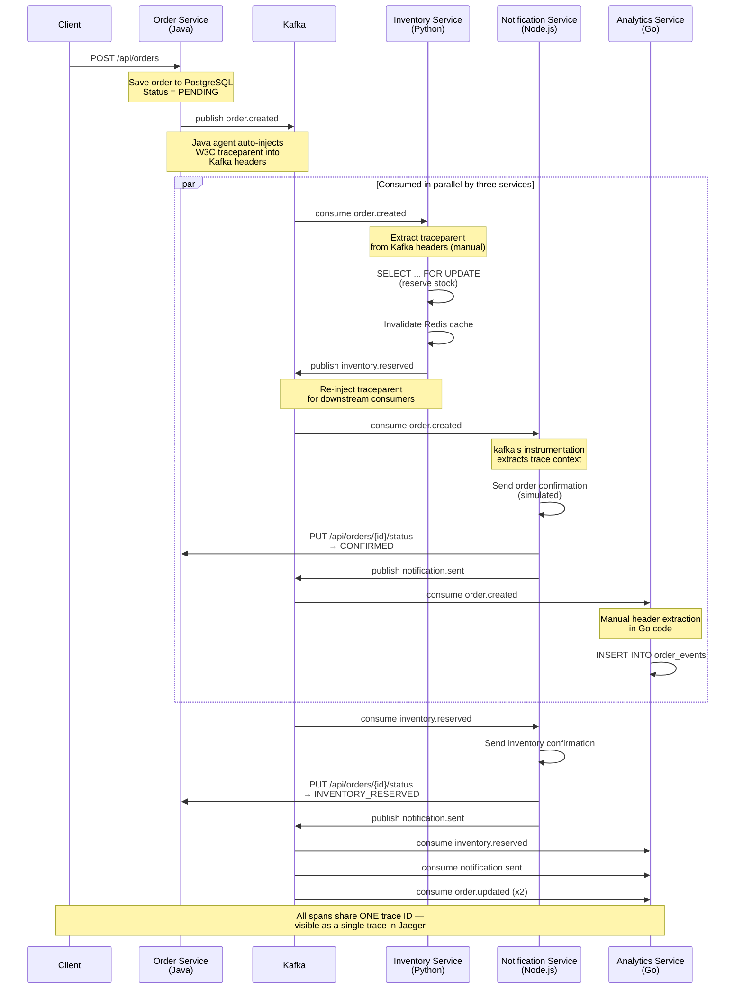

The goal: every span in this flow should share the same trace ID, producing a single, navigable trace in Jaeger.

---

## The Four Instrumentation Approaches

Each language handles OpenTelemetry differently. The amount of instrumentation code ranges from literally zero to a full SDK setup. The following diagram summarizes the spectrum:

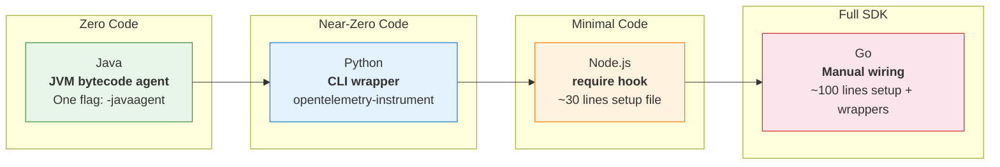

### 1. Java — The Gold Standard (Zero Code)

The OTel Java agent uses **JVM bytecode manipulation** to intercept library calls at the classloader level. It supports 200+ libraries out of the box. For this PoC, the entire setup was a single JVM flag in `docker-compose.yml`:

```yaml
JAVA_TOOL_OPTIONS: >-
  -javaagent:/otel/opentelemetry-javaagent.jar
  -Dotel.service.name=order-service
  -Dotel.exporter.otlp.endpoint=http://otel-collector:4317
```

**Lines of OTel code in the Java service: 0**

What the agent captures automatically:

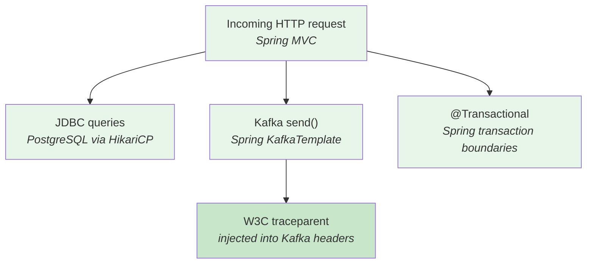

The Kafka trace context propagation is the critical piece. When the order service publishes `order.created`, the agent automatically injects `traceparent` and `tracestate` headers into the Kafka message. Without this, downstream consumers would start isolated traces.

> **Screenshot placeholder**: *[Insert screenshot of the Dockerfile showing the javaagent download and the JAVA_TOOL_OPTIONS in docker-compose.yml]*

---

### 2. Python — Near-Zero Code, With Notable Gaps

Python uses `opentelemetry-instrument`, a CLI wrapper that monkey-patches libraries at import time. The Dockerfile change is minimal — wrapping the application command:

```dockerfile
CMD ["opentelemetry-instrument",
     "uvicorn", "app.main:app",
     "--host", "0.0.0.0", "--port", "8081"]
```

This auto-instruments FastAPI, SQLAlchemy, Redis, and httpx. However, we encountered a significant gap:

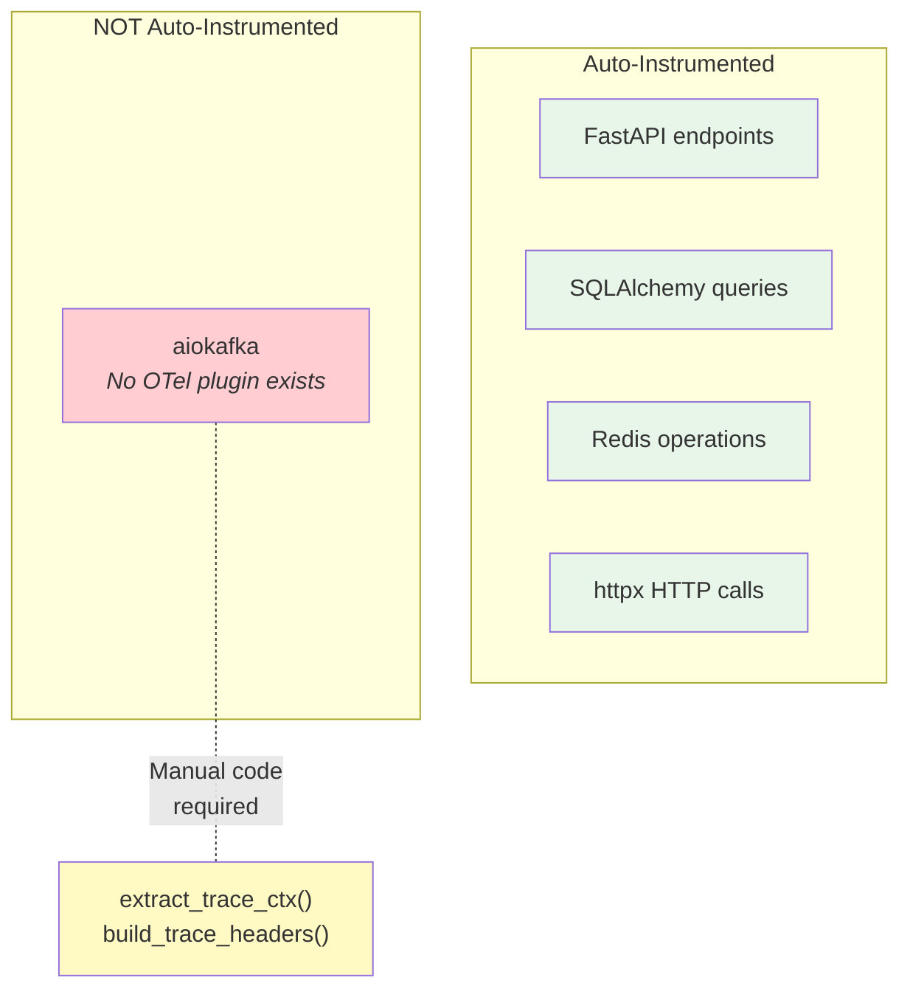

**`aiokafka` has no auto-instrumentation.** The OTel Python ecosystem covers `confluent-kafka` and `kafka-python`, but not the async client we were using. We had to write manual trace context extraction on the consumer side and injection on the producer side — approximately 15 lines of code per direction.

Without this manual intervention, the inventory service appeared as a completely isolated trace in Jaeger, disconnected from the order that triggered it.

> **Screenshot placeholder**: *[Insert screenshot showing the inventory-service trace in Jaeger BEFORE the fix (isolated trace) and AFTER (connected to order-service)]*

---

### 3. Node.js — One Setup File, One Dependency Gotcha

Node.js uses a `--require` hook to load a tracing setup file before the application code runs. This file initializes the OTel SDK and registers instrumentations:

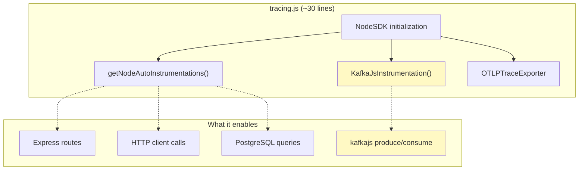

The gotcha: **`@opentelemetry/auto-instrumentations-node` does not reliably include kafkajs instrumentation** in many versions. We had to add `@opentelemetry/instrumentation-kafkajs` as a separate dependency and register it explicitly. Without it, the notification service consumed Kafka messages correctly but created entirely isolated traces.

**Lines of OTel code: ~30** (the tracing.js setup file)

> **Screenshot placeholder**: *[Insert screenshot of the tracing.js file and the package.json showing the kafkajs instrumentation dependency]*

---

### 4. Go — Full Manual, Full Control

Go compiles to a static binary. There is no classloader to hook into, no monkey-patching, no module system to intercept. The OTel SDK must be wired up explicitly in `main()`:

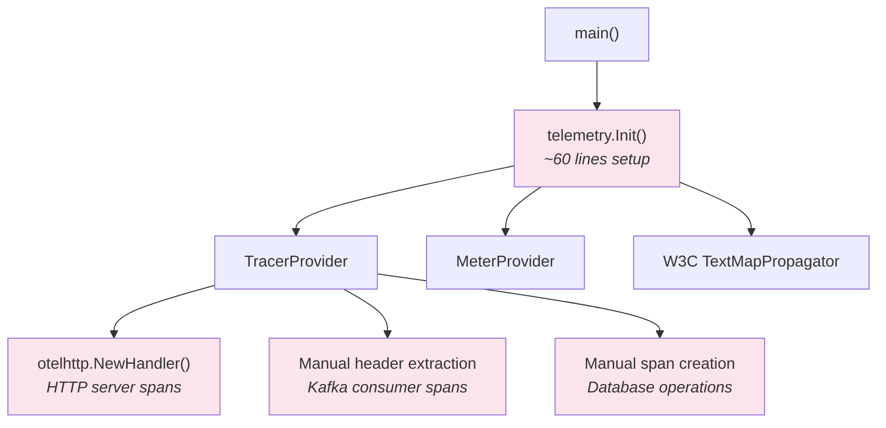

For Kafka consumption, we manually extract trace context from Sarama message headers. For HTTP, we use the `otelhttp` middleware wrapper. Every span is something the developer explicitly chose to create.

**Lines of OTel code: ~100** (setup.go + manual spans in consumer and handlers)

Go provides the most control over what gets traced, at the cost of the most boilerplate.

> **Screenshot placeholder**: *[Insert screenshot of the Go telemetry/setup.go and the consumer trace extraction code]*

---

### Instrumentation Effort Summary

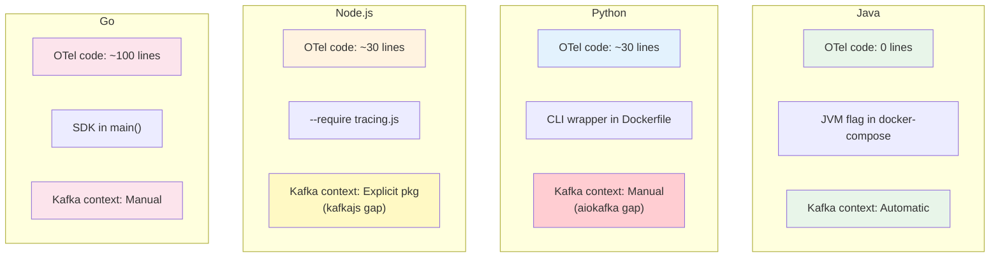

---

## The Moment of Truth — One Trace, Four Services

After starting the stack with `./start.sh`, we create a single order:

```bash
curl -X POST http://localhost:8080/api/orders \
  -H "Content-Type: application/json" \
  -d '{
    "customerId": "CUST-001",
    "productId": "PROD-001",
    "quantity": 2,
    "unitPrice": 1299.99
  }'
```

Opening Jaeger at `http://localhost:16686` and selecting `order-service` reveals the full distributed trace:

> **Screenshot placeholder**: *[Insert screenshot of the Jaeger trace list showing a trace with all 4 services]*

> **Screenshot placeholder**: *[Insert FULL screenshot of the Jaeger trace detail view showing the span timeline across all 4 services — this is the hero image of the article]*

### What Each Span Represents

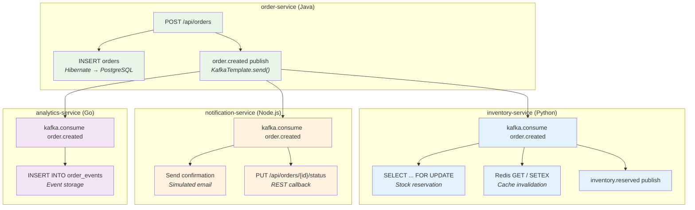

All spans share **one trace ID**. One request, one trace, four services, full visibility.

### Verifying via CLI

```bash
curl -s "http://localhost:16686/api/traces?service=order-service&limit=1" | \
python3 -c "
import json, sys
data = json.load(sys.stdin)
trace = data['data'][0]
services = set()
for span in trace['spans']:
    pid = span['processID']
    svc = trace['processes'][pid]['serviceName']
    services.add(svc)
print(f'Trace ID: {trace[\"traceID\"]}')
print(f'Spans:    {len(trace[\"spans\"])}')
print(f'Services: {sorted(services)}')
"
```

Expected output:
```
Trace ID: 8defd3093da9ea72...
Spans:    40+
Services: ['analytics-service', 'inventory-service', 'notification-service', 'order-service']
```

> **Screenshot placeholder**: *[Insert screenshot of the terminal showing this CLI output]*

---

## How Trace Context Propagation Works Through Kafka

This is the mechanism that makes or breaks distributed tracing across message brokers. HTTP propagation is well understood — trace context travels as HTTP headers. Kafka does not have HTTP headers, but it does have **message headers** — key-value pairs attached to each record.

### The W3C Traceparent Header

OTel uses the [W3C Trace Context](https://www.w3.org/TR/trace-context/) standard. The `traceparent` header encodes four fields:

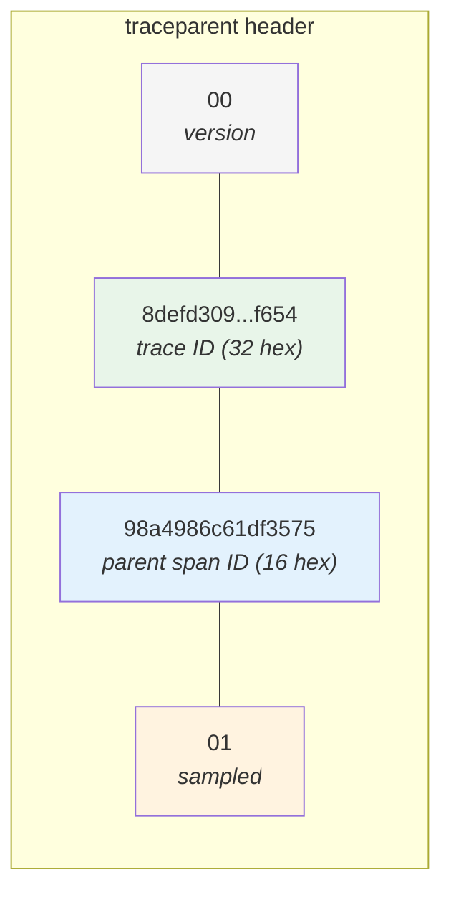

Format: `00-{trace_id}-{parent_span_id}-{flags}`

### How It Flows Through Kafka

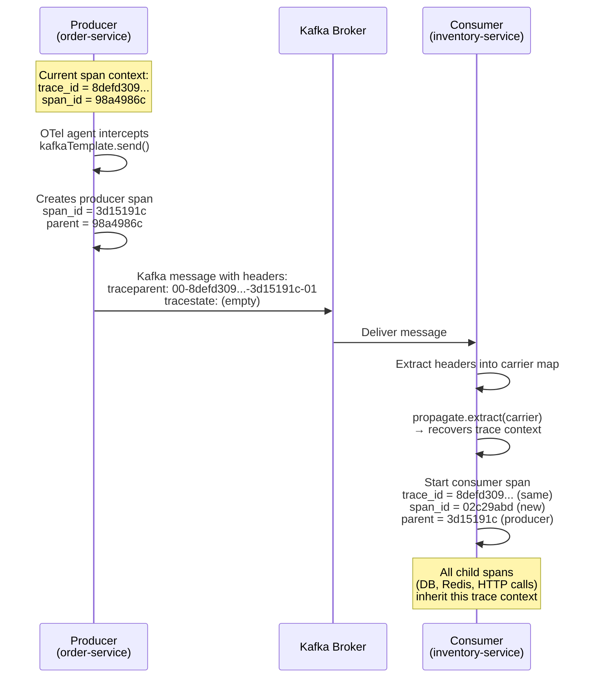

### The Key Insight

The Kafka message header carries the **trace ID** and the **producer's span ID**. When the consumer reads these headers, it does not create a new trace — it creates a new span under the existing trace, with the producer span as its parent.

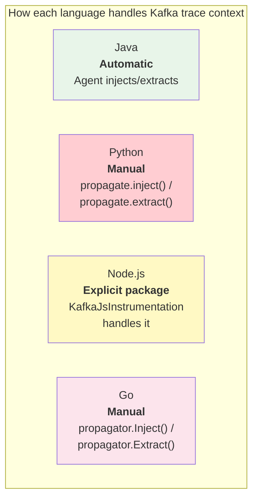

---

## What Auto-Instrumentation Covers (And What It Does Not)

This is where marketing meets reality. "Zero-code observability" applies only to libraries with a matching instrumentation plugin.

### What Gets Auto-Instrumented

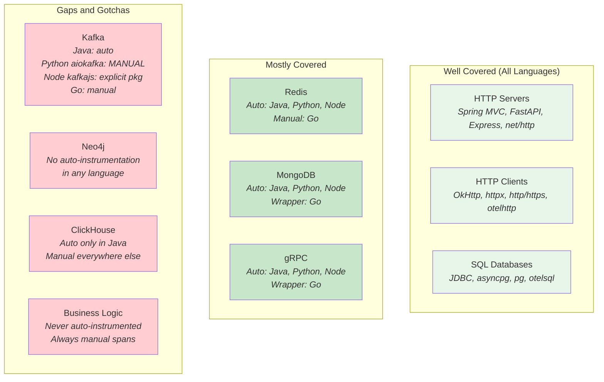

### Gaps We Encountered in This PoC

| Gap | Impact | Resolution |
|---|---|---|
| Python `aiokafka` not instrumented | Inventory service traces were isolated | Wrote manual `extract_trace_ctx()` and `build_trace_headers()` (~30 lines) |
| Node.js `kafkajs` not bundled | Notification service traces were isolated | Added `@opentelemetry/instrumentation-kafkajs` as explicit dependency |
| Go has no runtime agent | All spans required explicit creation | Wired OTel SDK in `main()`, used `otelhttp` wrapper, manual Kafka header extraction |

### Additional Caveats Worth Noting

| Caveat | Detail |
|---|---|
| **GraalVM Native Image** | Incompatible with the Java agent (bytecode manipulation vs. SubstrateVM). Use Spring Boot Starter or Quarkus OTel extension instead |
| **Gunicorn + Python** | `BatchSpanProcessor` background thread + `--preload` forking = deadlocks. Use `UvicornWorker` or initialize OTel in `post_fork` |
| **Version ceilings** | Python `confluent-kafka` support: 1.8.2–2.11.0 only. `SQLAlchemy`: 1.0.0–2.1.0. Outside these ranges, instrumentation silently skips |
| **Node.js `instrumentation-fs`** | Causes 3x memory spikes — disabled by default in `auto-instrumentations-node` |
| **Go `otelsarama`** | References deprecated `Shopify/sarama` import path (now `IBM/sarama`). The contrib package has not fully caught up |

---

## Performance Overhead — The Cost of Tracing

OTel agents are not free. They share your application's process, memory, and CPU.

### Startup Impact

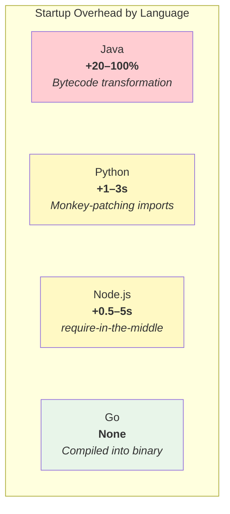

### Runtime Impact

| Metric | Typical Range | Notes |
|---|---|---|
| CPU | +2–5% | Can reach 20% at 100% sampling under heavy load |
| Memory | +50–200 MB (Java), +20–80 MB (others) | Span buffers, metric aggregations, exporter queues |
| Request latency | +0.5–2ms per request | Span creation, attribute recording, context propagation |
| Throughput | -1–5% | Community reports up to 33% drop at 100% sampling in high-QPS Java services |

**Production recommendation**: This PoC uses 100% sampling for maximum visibility. Production deployments should use **probabilistic sampling** (e.g., 10% of traces) or **tail-based sampling** (keep errors and slow requests, sample the rest) to control overhead.

---

## Metrics — The Other Half of Observability

Traces reveal individual request flows. Metrics reveal aggregate behavior over time. Each service exposes Prometheus-compatible endpoints:

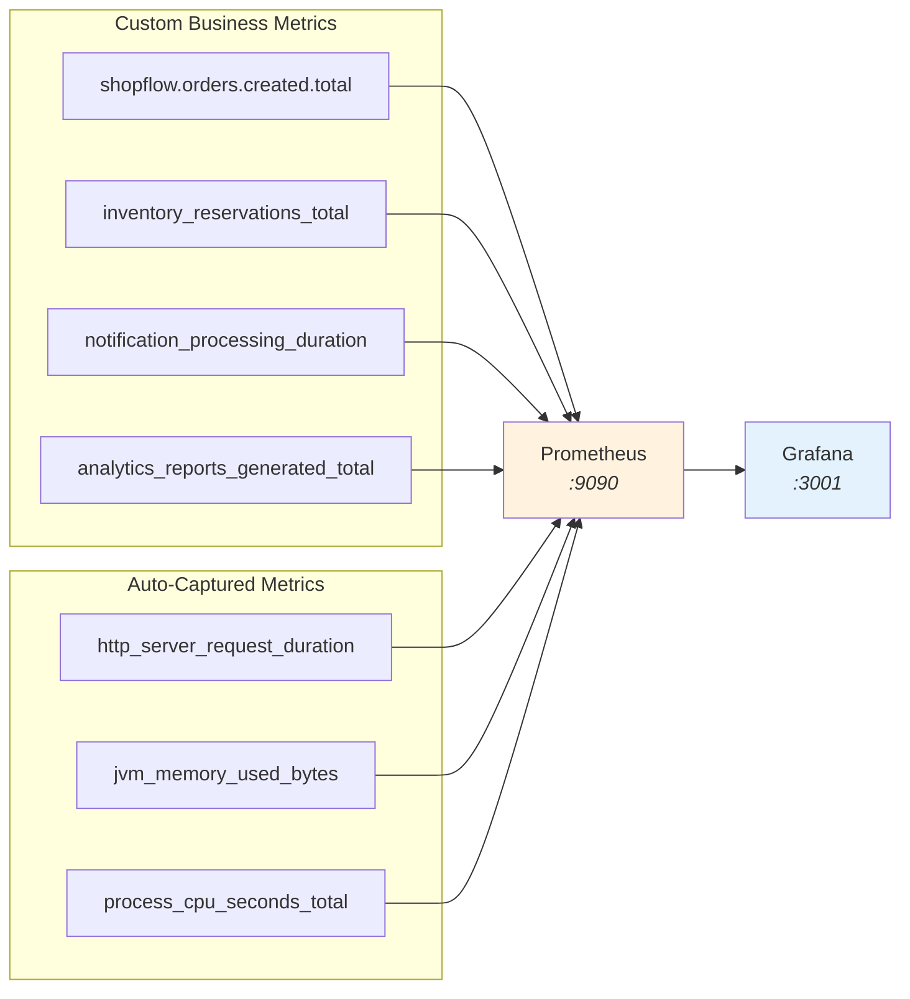

> **Screenshot placeholder**: *[Insert screenshot of Prometheus graph showing order creation rate or notification latency]*

> **Screenshot placeholder**: *[Insert screenshot of Grafana Explore page with Jaeger datasource showing a trace search]*

---

## Running It Yourself

### Prerequisites

- Docker and Docker Compose (v2+)
- ~4 GB of free RAM
- Ports: 3001, 4317, 4318, 5432, 6379, 8080–8083, 8090, 9090, 16686

### Start

```bash
git clone <repo-url>
cd otel-agent-polyglot-poc
chmod +x start.sh stop.sh
./start.sh
```

The script builds all four services, starts 13 containers, waits for health checks, and prints all URLs.

### Test

```bash
# Create an order — triggers the full event chain
curl -X POST http://localhost:8080/api/orders \
  -H "Content-Type: application/json" \
  -d '{"customerId":"CUST-001","productId":"PROD-001","quantity":2,"unitPrice":1299.99}'

# Open Jaeger to see the trace
open http://localhost:16686
```

### Clean Up

```bash
docker compose down -v
```

---

## Lessons Learned

### 1. Auto-instrumentation is a starting point, not a complete solution

It covers HTTP and popular databases out of the box. Async Kafka clients, graph databases, and custom protocols require manual intervention.

### 2. Kafka trace propagation is the hardest part

Getting spans for produce/consume operations is straightforward. Getting the **trace context** to flow through message headers so consumers join the same trace as the producer — that is where three out of four services required explicit work.

### 3. Go is the outlier

No agent, no monkey-patching, no runtime hooks. Every span is an explicit choice. The Go eBPF auto-instrumentation (released in beta in 2025) may change this, but it is not yet production-ready and is limited to a small set of libraries.

### 4. The Java agent is impressively comprehensive

Zero lines of OTel code. It handles Spring MVC, JDBC, Kafka (including trace context propagation through message headers), Redis, and transaction boundaries. The tradeoff is startup time — plan for 20–100% slower cold starts.

### 5. One trace across Kafka is powerful but dangerous at scale

In this PoC, one order produces ~40 spans across four services. In production, where a single event may trigger hundreds of downstream messages, trace fan-out can overwhelm your tracing backend. We explore this in detail in the [companion article on batch tracing](blog-2-kafka-batch-fanout-tracing.md).

---

## What's Next

In the [next article](blog-2-kafka-batch-fanout-tracing.md), we explore Kafka batch tracing in depth:
- What happens when one HTTP request sends N messages to Kafka?
- How are trace IDs, span IDs, and parent relationships assigned?
- The fan-out problem and strategies for controlling it in production

---

*The complete source code for this PoC is available at [GitHub repo link]. See TESTING.md for the full list of curl commands, PromQL queries, and troubleshooting steps.*

---

> **Screenshot placeholder summary** — Images to capture before publishing:
> 1. Dockerfile showing javaagent download + docker-compose.yml JAVA_TOOL_OPTIONS
> 2. Jaeger trace list showing a trace spanning all 4 services
> 3. Jaeger trace detail view (full span timeline) — **hero image**
> 4. Before/after: inventory-service trace isolated vs connected
> 5. Node.js tracing.js file and package.json kafkajs dependency
> 6. Go telemetry/setup.go and consumer trace extraction code
> 7. Terminal output of the CLI trace verification script
> 8. Prometheus graph (order creation rate or notification latency)
> 9. Grafana Explore page with Jaeger datasource
