# How Kafka Batch Messages Get Traced — Span IDs, Fan-Out, and the Gotcha Nobody Talks About

*We sent 5 Kafka messages from one HTTP request and dissected exactly how OpenTelemetry assigns trace IDs, span IDs, and parent relationships. Here is what we found — and why it matters at scale.*

---

## The Question

You have a REST endpoint that publishes multiple Kafka messages in a single request. Maybe it is a batch import, a fan-out notification, or an order that triggers events for inventory, billing, and shipping.

The question is: **how does OpenTelemetry trace this?**

- Does each message get its own trace?
- Do all messages share one trace with one producer span?
- Or something else entirely?

We built a test endpoint, sent 5 messages, pulled the raw span data from Jaeger, and mapped every `trace_id`, `span_id`, and `parent_id` relationship. Here is exactly what happens.

---

## The Test Setup

We added a batch test endpoint to our Spring Boot order-service that sends N messages to a `batch.test` Kafka topic. Each message carries a random action type (`STOCK_CHECK`, `PRICE_LOOKUP`, `RESTOCK_ALERT`, `AUDIT_LOG`, `CACHE_WARM`, `REPORT_GENERATE`).

On the consumer side, a Python FastAPI service subscribes to `batch.test` and routes each message to a different handler. Each handler performs distinct operations — database queries, Redis cache updates, HTTP calls to other services — producing unique span subtrees.

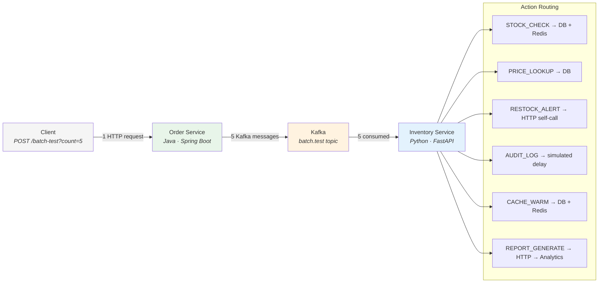

---

## The Two Mental Models

Before looking at the data, let us address the two common assumptions about how batch Kafka tracing works.

### Model A — "One Producer Span, N Consumer Children" (Incorrect)

Many developers assume this structure:

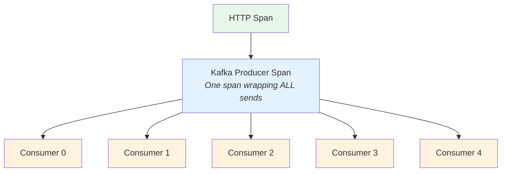

Under this model, one producer span wraps all `send()` calls, and all consumers are siblings. **This is NOT what happens.**

### Model B — "N Producer Spans, Each With One Consumer Child" (Correct)

What actually happens:

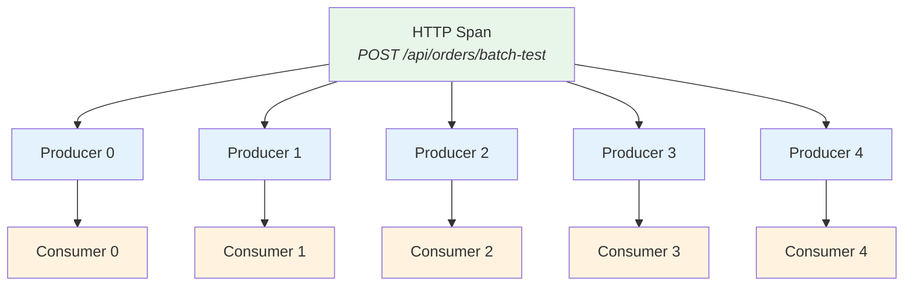

The OTel Java agent creates **one producer span per `send()` call**. Each consumer becomes a child of its **own** producer span — not a sibling of the other consumers.

---

## The Experiment

### Step 1 — Trigger the Batch

```bash
curl -s -X POST "http://localhost:8080/api/orders/batch-test?count=5" | python3 -m json.tool
```

Response:
```json
{
  "sent": 5,
  "topic": "batch.test",
  "events": [
    {"seq": 0, "action": "AUDIT_LOG",      "productId": "PROD-003"},
    {"seq": 1, "action": "CACHE_WARM",      "productId": "PROD-002"},
    {"seq": 2, "action": "AUDIT_LOG",       "productId": "PROD-002"},
    {"seq": 3, "action": "AUDIT_LOG",       "productId": "PROD-001"},
    {"seq": 4, "action": "RESTOCK_ALERT",   "productId": "PROD-005"}
  ]
}
```

### Step 2 — Pull the Raw Trace from Jaeger

After a few seconds, we query Jaeger's API and extract every span with its IDs.

> **Screenshot placeholder**: *[Insert screenshot of Jaeger UI showing the batch-test trace with the full span timeline — all 29 spans visible with the fan-out structure]*

### Step 3 — The Raw Span Relationship Data

Here is the actual span hierarchy from our test run, with every ID mapped:

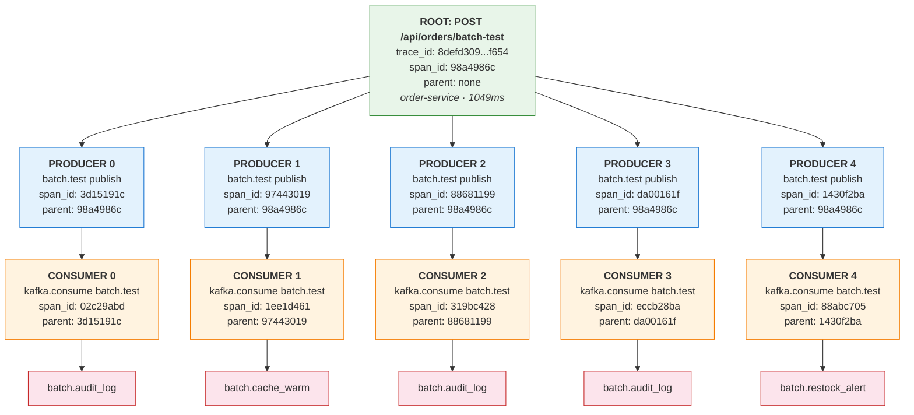

**Total: 29 spans, 1 trace ID, all span IDs unique.**

---

## What This Proves — Line by Line

### 1. All spans share the same trace ID

Every one of the 29 spans carries `trace_id = 8defd3093da9ea72060207257173f654`. One request, one trace — this is the fundamental property of distributed tracing.

### 2. Every span has a unique span ID

29 spans, 29 different `span_id` values. Span IDs are never shared. Even though producer[0] and producer[1] perform the same operation (`batch.test publish`), they have completely different span IDs.

### 3. The Java agent creates one producer span per `send()` call

The code calls `kafkaTemplate.send()` five times in a loop. The OTel Java agent wraps **each individual call** in its own span — producing 5 producer spans, not 1.

### 4. Each consumer is a child of its OWN producer — not a sibling

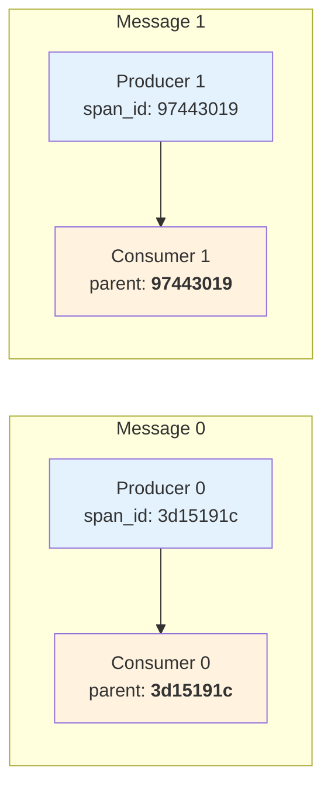

Consumer 0 has `parent = 3d15191c` (producer 0). Consumer 1 has `parent = 97443019` (producer 1). They are **not** siblings under one shared parent. Each consumer-producer pair forms an independent branch.

### 5. All producer spans are children of the HTTP root

Every producer span has `parent = 98a4986c` (the `POST /api/orders/batch-test` span). The HTTP request span is the common ancestor that ties the entire fan-out together.

---

## How the W3C Traceparent Header Travels

Let us trace the exact mechanism for message 0:

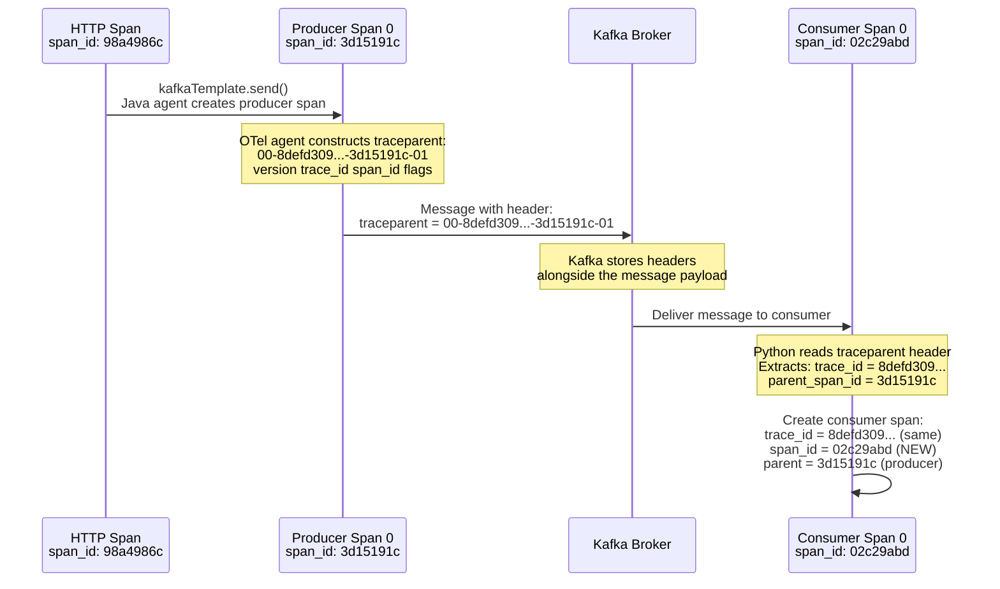

The critical detail: the `traceparent` header contains the **producer's span ID** as the parent. When the consumer reads this and creates its span, it sets `parent = 3d15191c` (the producer), not `parent = 98a4986c` (the HTTP root).

This is precisely why consumers are children of their specific producer span, not siblings under the HTTP span.

---

## Comparing Message 0 vs Message 1

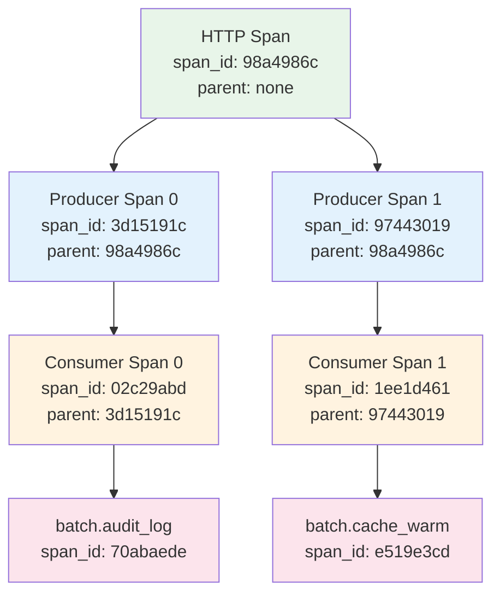

Message 0's `traceparent` header contains `span_id = 3d15191c`. Message 1's header contains `span_id = 97443019`. They differ because each `send()` call generates its own producer span with its own ID.

The trace ID (`8defd309...`) is identical in both headers — that is what keeps them in the same trace.

---

## What Each Action Does (And How It Appears in Traces)

Each message receives a random action type. Different actions take different code paths and produce distinct span subtrees.

### STOCK_CHECK — Database + Cache

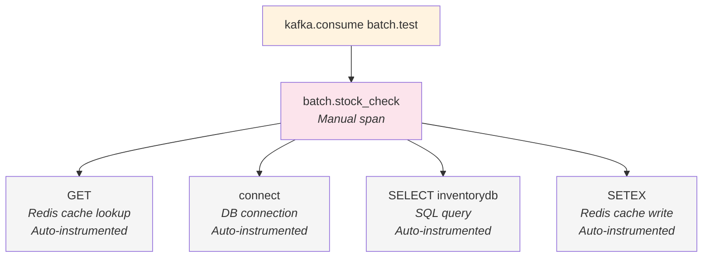

The manual span is `batch.stock_check`. Everything nested inside (Redis GET, SQL SELECT, Redis SETEX) is auto-instrumented by the Python OTel agent — zero additional code for those.

> **Screenshot placeholder**: *[Insert Jaeger screenshot showing a STOCK_CHECK span expanded with its Redis and SQL child spans]*

### RESTOCK_ALERT — Self HTTP Call

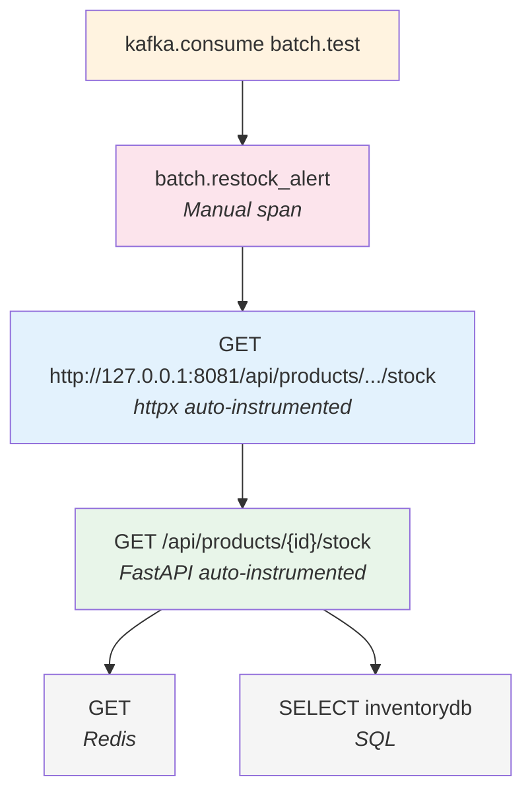

This is particularly interesting — the consumer calls its **own** HTTP endpoint. The outgoing HTTP call is auto-instrumented by `opentelemetry-instrumentation-httpx`, and the incoming request is auto-instrumented by FastAPI instrumentation. The full round-trip is visible in one trace.

> **Screenshot placeholder**: *[Insert Jaeger screenshot showing the RESTOCK_ALERT span with the nested HTTP self-call]*

### REPORT_GENERATE — Cross-Service HTTP Call

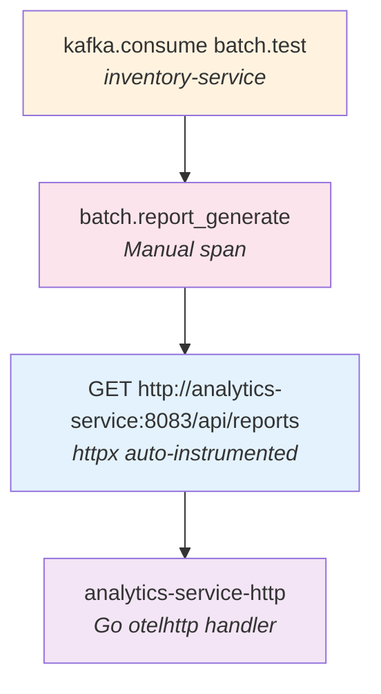

This crosses service boundaries. The Python consumer makes an HTTP call to the Go analytics service. The trace flows from Python to Go via HTTP headers. Three services represented in one trace branch.

> **Screenshot placeholder**: *[Insert Jaeger screenshot showing the REPORT_GENERATE span crossing from inventory-service to analytics-service]*

### AUDIT_LOG — Simulated Delay

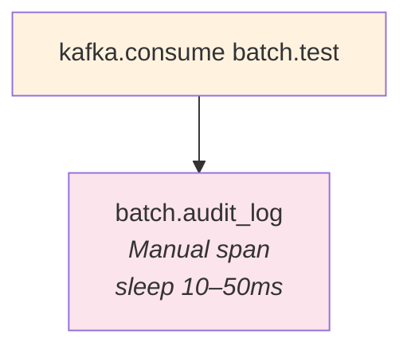

The simplest case. One manual span, no infrastructure calls. Demonstrates the duration of a simulated audit write.

### CACHE_WARM — Pre-load Cache

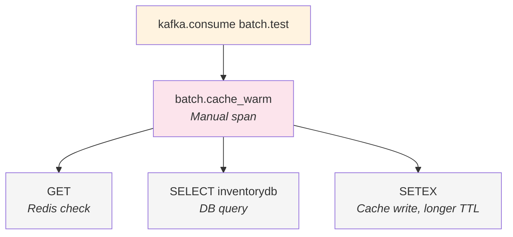

Similar to STOCK_CHECK but with a longer cache TTL. Useful for observing how identical infrastructure calls appear consistently across different business operations.

---

## The Full Picture — 5 Messages, 29 Spans, 1 Trace

Here is the complete trace tree from our test run with timing data:

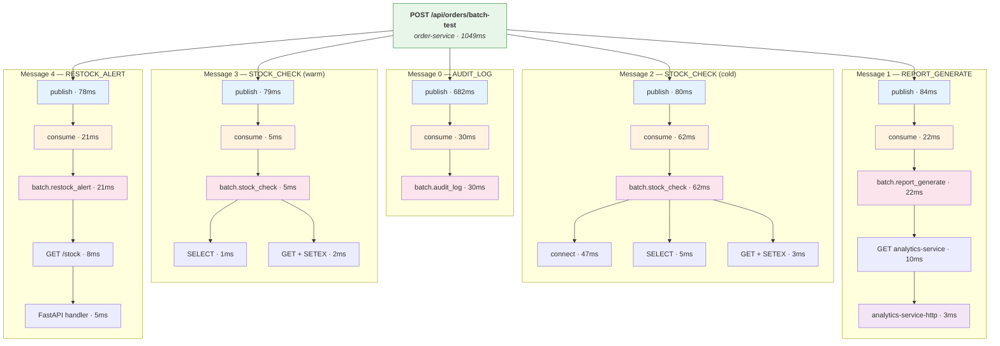

Notice how the second STOCK_CHECK (message 3) is dramatically faster than the first (message 2) — 5ms vs 62ms. The first had a cold database connection (47ms for `connect`) and a cache miss. The second hit the warmed cache and an established connection. This kind of insight is exactly why distributed tracing is valuable.

> **Screenshot placeholder**: *[Insert FULL Jaeger trace detail screenshot showing all 29 spans in the timeline view — this is the hero image of this article]*

---

## The Verification Script

Run this yourself to see the exact span relationships:

```bash
curl -s "http://localhost:16686/api/traces?service=order-service&operation=POST+%2Fapi%2Forders%2Fbatch-test&limit=1" | \
python3 -c "
import json, sys
data = json.load(sys.stdin)
trace = data['data'][0]
trace_id = trace['traceID']

root = next(s for s in trace['spans'] if s['operationName'] == 'POST /api/orders/batch-test')
producers = sorted(
    [s for s in trace['spans'] if 'publish' in s['operationName']],
    key=lambda s: s['startTime']
)
consumers = {
    c['references'][0]['spanID']: c
    for c in trace['spans']
    if c['operationName'] == 'kafka.consume batch.test' and c.get('references')
}

print(f'Trace ID:  {trace_id}')
print(f'Spans:     {len(trace[\"spans\"])}')
print(f'Root span: {root[\"spanID\"]}  (POST /api/orders/batch-test)')
print()

for i, p in enumerate(producers):
    parent = p.get('references', [{}])[0].get('spanID', '?')
    c = consumers.get(p['spanID'])
    action = None
    if c:
        action = next(
            (s for s in trace['spans']
             if s.get('references') and s['references'][0].get('spanID') == c['spanID']
             and 'batch.' in s['operationName']),
            None
        )
    print(f'msg[{i}]  producer={p[\"spanID\"][:12]}  parent={parent[:12]}(root)  '
          f'consumer={c[\"spanID\"][:12] if c else \"?\"}  '
          f'action={action[\"operationName\"] if action else \"?\"}')

print()
print('All spans share same trace_id:', all(s['traceID'] == trace_id for s in trace['spans']))
print('All span_ids unique:', len(set(s['spanID'] for s in trace['spans'])) == len(trace['spans']))
"
```

---

## The Fan-Out Problem — Why This Matters at Scale

In this test, 5 messages created 29 spans. That is approximately 6 spans per message (producer + consumer + action + infrastructure). Now consider production scenarios:

```mermaid
flowchart TD
    subgraph "5 Messages — No Problem"
        a_http["1 HTTP request"]
        a_spans["29 spans"]
        a_result["Jaeger handles fine"]
        a_http --> a_spans --> a_result
    end

    subgraph "50 Messages — Watch Closely"
        b_http["1 HTTP request"]
        b_spans["~300 spans"]
        b_result["Jaeger slows down"]
        b_http --> b_spans --> b_result
    end

    subgraph "1,000 Messages — Problem"
        c_http["1 HTTP request"]
        c_spans["~6,000 spans"]
        c_result["Jaeger struggles"]
        c_http --> c_spans --> c_result
    end

    subgraph "10,000 Messages — Critical"
        d_http["1 HTTP request"]
        d_spans["~60,000 spans"]
        d_result["Collector OOMs"]
        d_http --> d_spans --> d_result
    end

    style a_result fill:#e8f5e9
    style b_result fill:#fff9c4
    style c_result fill:#ffcdd2
    style d_result fill:#b71c1c,color:#fff
```

This is **trace fan-out** — the number one reason production OTel deployments fail when Kafka is involved.

### The Core Issue

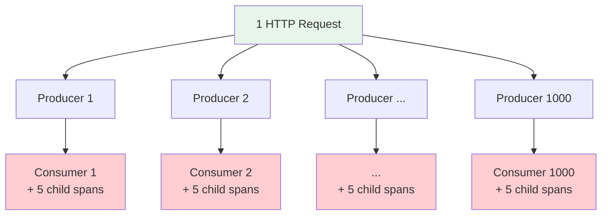

One trace with 6,000+ spans. Jaeger stores it as a single document. The collector buffers the entire trace. The UI attempts to render it. Everything degrades.

### Solution 1 — Use Links Instead of Parent-Child

Instead of propagating the parent trace context, the consumer creates a **new trace** and adds a **link** back to the producer for reference:

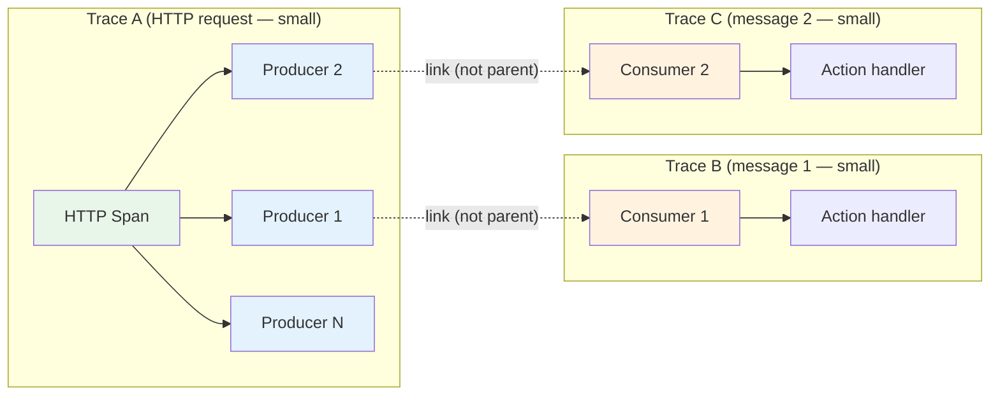

The producer trace stays small (HTTP + N producer spans). Each consumer trace is independent and small. The link preserves correlation for debugging without bloating any single trace.

```python
# Consumer-side implementation
from opentelemetry.trace import Link

producer_ctx = extract_trace_ctx(message.headers)
producer_span_ctx = trace.get_current_span(producer_ctx).get_span_context()

with tracer.start_as_current_span(
    "kafka.consume batch.test",
    links=[Link(producer_span_ctx)],   # link, not parent
    kind=trace.SpanKind.CONSUMER,
):
    await process(message)
```

### Solution 2 — Probabilistic Propagation

Propagate trace context on only a fraction of messages:

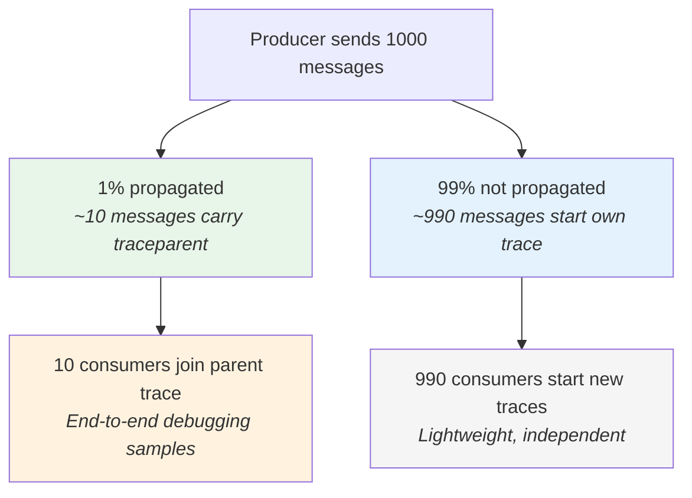

99% of messages start their own trace. 1% carry the parent context for end-to-end debugging when needed.

### Solution 3 — Tail-Based Sampling at the Collector

Allow the collector to decide which traces to keep after seeing the complete trace:

```yaml
# otel-collector config
processors:
  tail_sampling:
    policies:
      - name: sample-errors
        type: status_code
        status_code: {status_codes: [ERROR]}
      - name: sample-slow
        type: latency
        latency: {threshold_ms: 5000}
      - name: sample-rest
        type: probabilistic
        probabilistic: {sampling_percentage: 1}
```

Always keep error traces and slow traces. Sample 1% of the rest. This requires the collector to buffer complete traces before making a decision, which increases memory usage.

---

## The Cheat Sheet

### Identifiers

| Identifier | Meaning | Scope |
|---|---|---|
| `trace_id` | One entire request flow | Shared across all spans in the trace |
| `span_id` | One operation within the flow | Always unique, never shared |
| `parent_span_id` | Who created this span | Points to the parent span's `span_id` |

### What Gets Propagated in Kafka Headers

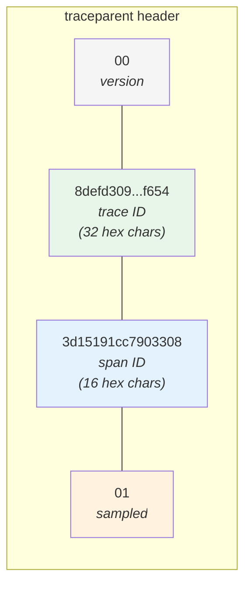

The consumer reads this and creates a child span with:
- Same `trace_id` (keeps it in the same trace)
- New `span_id` (every span is unique)
- `parent = 3d15191c...` (the producer's span_id from the header)

### The Rules

1. `trace_id` is the same across all spans in one trace
2. `span_id` is always unique — never reused, never shared
3. Each `kafkaTemplate.send()` creates its own producer span (not one wrapping span)
4. Each consumer span is a child of its **own** producer span (not siblings)
5. The `traceparent` header carries `trace_id` + producer's `span_id`
6. Auto-instrumented spans (SQL, Redis, HTTP) nest inside manual spans automatically

### When to Break the Trace Chain

| Messages per Request | Recommendation |
|---|---|
| 1–10 | Propagate normally (CHILD_OF) |
| 10–100 | Monitor trace sizes in Jaeger. Consider links if spans > 500 |
| 100–1,000 | Use links instead of parent-child |
| 1,000+ | Must use links + sampling. Single traces will exhaust collector memory |

---

## Try It Yourself

```bash
# Start the stack
./start.sh

# Send a batch of 5 messages
curl -s -X POST "http://localhost:8080/api/orders/batch-test?count=5"

# Wait 5 seconds, then check Jaeger
open http://localhost:16686
# Select order-service → POST /api/orders/batch-test → Find Traces

# Or verify via CLI (see verification script above)

# Try a larger batch to observe scale
curl -s -X POST "http://localhost:8080/api/orders/batch-test?count=20"

# Clean up
docker compose down -v
```

> **Screenshot placeholder**: *[Insert screenshot of Jaeger showing the batch-test trace with 5 messages and the fan-out structure]*

> **Screenshot placeholder**: *[Insert screenshot of Jaeger showing a larger batch (20 messages) to illustrate scale]*

> **Screenshot placeholder**: *[Insert screenshot of Kafka UI showing the batch.test topic with message headers containing traceparent]*

---

## Summary

| Question | Answer |
|---|---|
| Do all batch messages share one trace? | **Yes** — same `trace_id` everywhere |
| Is there one producer span or N? | **N** — one per `send()` call |
| Are consumers siblings? | **No** — each is a child of its own producer span |
| Are span IDs shared? | **Never** — every span gets a unique ID |
| What flows through Kafka headers? | `traceparent` = `trace_id` + producer's `span_id` |
| Does auto-instrumentation work inside manual spans? | **Yes** — SQL, Redis, HTTP spans nest automatically |
| Will this scale to 1000+ messages? | **No** — use links or sampling for fan-out control |

The key misconception is that Kafka messages "share a span ID." They do not. They share a **trace ID**. Each message gets its own producer span, its own consumer span, and its own subtree. The trace ID is the thread that ties them all together.

---

*This is Part 2 of our OpenTelemetry polyglot tracing series. [Part 1](blog-1-otel-polyglot-tracing.md) covers the full architecture, all four instrumentation approaches, and how to set up the complete PoC.*

*Source code: [GitHub repo link]*

---

> **Screenshot placeholder summary** — Images to capture before publishing:
> 1. Jaeger trace list showing the batch-test trace (hero image — the full 29-span timeline)
> 2. Jaeger zoomed into a STOCK_CHECK span showing Redis + SQL child spans
> 3. Jaeger zoomed into a RESTOCK_ALERT span showing the HTTP self-call
> 4. Jaeger zoomed into a REPORT_GENERATE span showing cross-service to analytics
> 5. Kafka UI showing batch.test topic messages with traceparent in headers
> 6. Jaeger showing a larger batch (20 messages) to illustrate scale
> 7. Terminal output of the verification script
